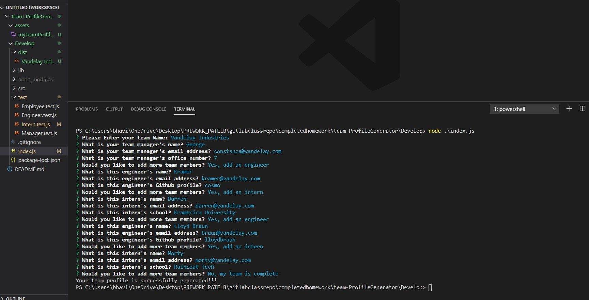

## Project Title
  #Team Profile Generator
  
  ## Table of Contents

* [Description](#description)
* [Installation](#installation)
* [Usage](#usage)
* [Contribution Guidelines](#contribution-guidelines)
* [License](#license)
* [Questions](#questions)

## Description

A Node.js application which takes in inforamtion about an employess on your team, then generates a HTML webpage that displays summaries for each person.

## Installation Instructions

To install the required dependencies, please run the following command:

```
You will need node.js Installed
```

## Usage
Walkthough of creating Team Profile

## Mock-up :



## Contribution Guidelines
Link to Contributor's Covenant: https://www.contributor-covenant.org/version/2/0/code_of_conduct/

## License


*This project uses the [MIT](https://spdx.org/licenses/MIT.html) license.*


## Questions
Github Profile : [Creator]:(https://github.com/bhavipatel21)

If you have any questions please email me at bhavij0511@gmail.com
  
  